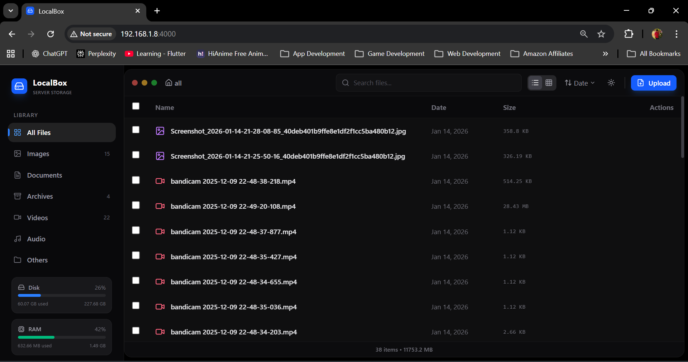
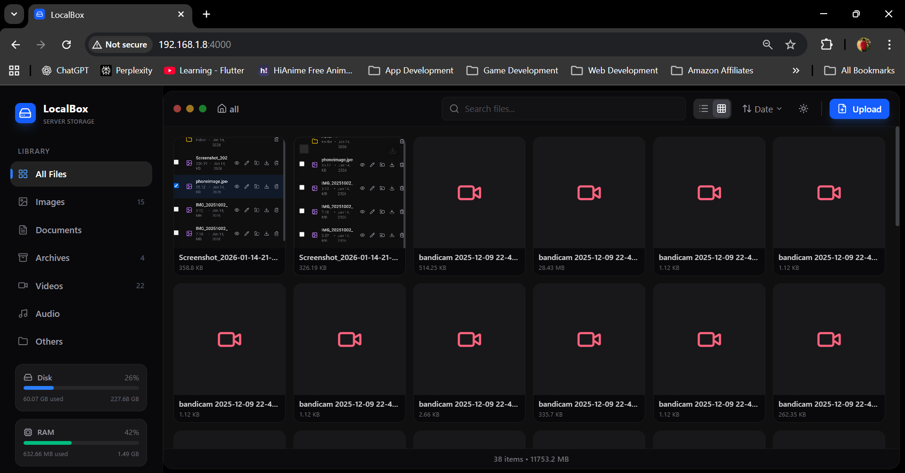
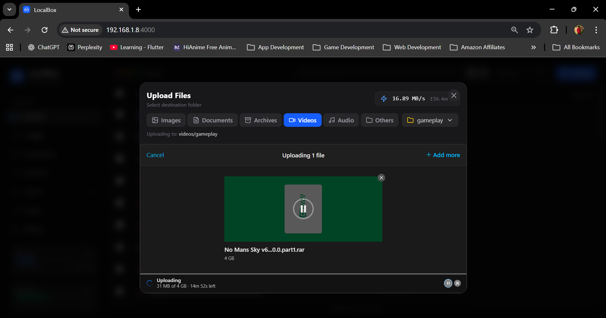
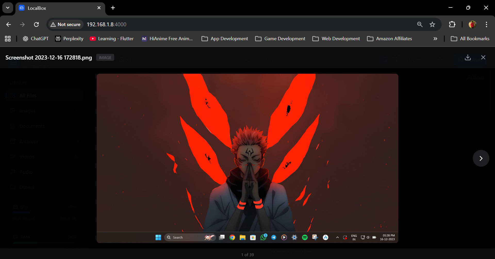
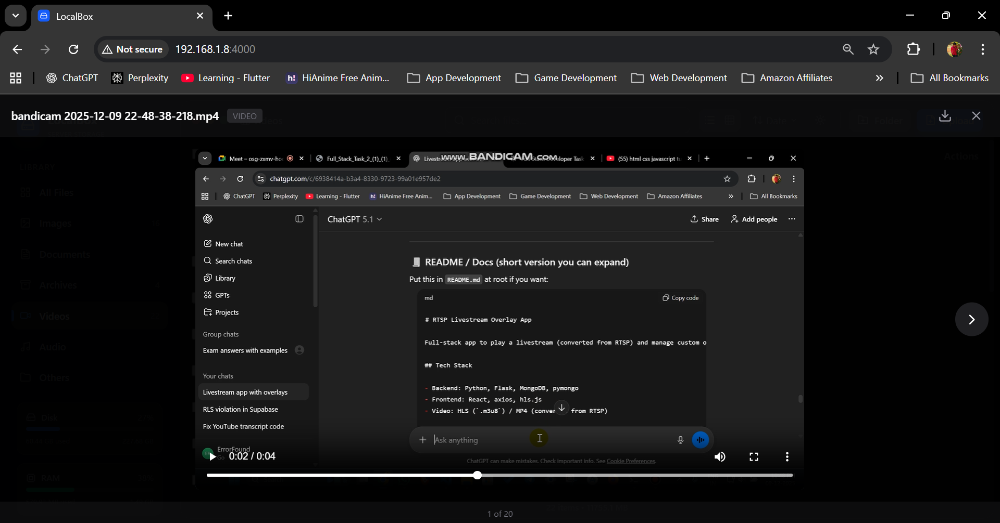

# 📦 LocalBox

A self-hosted file storage and management application with a modern, Mac-like interface. Access your files from any device on your local network.

  

## 📸 Screenshots

<p align="center">
  
</p>

<p align="center"><em>LocalBox running on a repurposed old laptop as a home server</em></p>

<p align="center">
  
</p>

<p align="center"><em>Dashboard - File list with sidebar navigation</em></p>

| Grid View | Upload Dialog |
|-----------|---------------|
|  |  |

| Image Preview | Video Preview |
|---------------|---------------|
|  |  |


## ✨ Features

### File Management
- 📤 **Resumable Uploads** - TUS protocol for large file uploads with pause/resume
- 📁 **Folder Support** - Create subfolders, navigate with breadcrumbs
- 🔍 **Search** - Real-time file search
- 📋 **Bulk Actions** - Select multiple files for download, move, or delete
- ✏️ **Rename & Move** - Organize files across categories and folders

### Preview & View
- 🖼️ **Image Preview** - View images with keyboard navigation
- 🎬 **Video Player** - Stream videos directly in browser
- 🎵 **Audio Player** - Play audio files
- 📄 **PDF Viewer** - View documents inline
- 📊 **Grid/List View** - Toggle between thumbnail grid and detailed list

### UI/UX
- 🌙 **Dark/Light Theme** - Switch themes with persistence
- 📱 **Responsive** - Works on desktop, tablet, and mobile
- 🖱️ **Drag & Drop** - Drop files anywhere to upload
- ⚡ **Fast** - Optimized with lazy loading and caching

### System
- 💾 **Storage Stats** - Real-time disk usage display
- 🧠 **RAM Monitor** - Live memory usage indicator
- 🏷️ **Auto-categorize** - Files sorted by type (images, videos, documents, etc.)

## 🚀 Quick Start

### Prerequisites
- Node.js 18+
- npm or yarn

### Installation

```bash
# Clone the repository
git clone https://github.com/yourusername/localbox.git
cd localbox

# Install backend dependencies
cd localbox-backend
npm install

# Install frontend dependencies
cd ../localbox-frontend
npm install
```

### Development

```bash
# Terminal 1: Start backend (port 4000)
cd localbox-backend
npm start

# Terminal 2: Start frontend (port 5173)
cd localbox-frontend
npm run dev
```

Open http://localhost:5173 in your browser.

### Production

```bash
# Build frontend
cd localbox-frontend
npm run build

# Start backend (serves frontend from dist/)
cd ../localbox-backend
npm start
```

Access at http://your-ip:4000

## 📁 Project Structure

```
localbox/
├── localbox-backend/
│   ├── index.js          # Express server with TUS upload
│   ├── categorizer.js    # File type detection
│   └── package.json
├── localbox-frontend/
│   ├── src/
│   │   ├── App.jsx       # Main application
│   │   └── components/   # React components
│   └── package.json
└── README.md
```

## ⚙️ Configuration

### Environment Variables

| Variable | Default | Description |
|----------|---------|-------------|
| `PORT` | 4000 | Server port |
| `STORAGE_DIR` | `~/Downloads/localboxstorage` | File storage path |

### Categories

Files are auto-categorized by extension:

| Category | Extensions |
|----------|------------|
| Images | jpg, png, gif, webp, svg... |
| Videos | mp4, webm, mov, mkv, avi... |
| Audio | mp3, wav, flac, m4a, ogg... |
| Documents | pdf, doc, docx, txt, md... |
| Archives | zip, rar, 7z, tar, gz... |
| Others | Everything else |

## 🔌 API Endpoints

| Method | Endpoint | Description |
|--------|----------|-------------|
| `GET` | `/api/files` | List files |
| `GET` | `/api/stats` | Storage & RAM stats |
| `GET` | `/api/folders/:cat` | List folders |
| `POST` | `/api/folders` | Create folder |
| `DELETE` | `/api/files/:cat/:path` | Delete file |
| `PUT` | `/api/files/:cat/:path` | Rename file |
| `PATCH` | `/api/files/:cat/:path/move` | Move file |
| `POST` | `/files` | TUS upload endpoint |

## 🛠️ Tech Stack

- **Frontend**: React 18, Vite, Tailwind CSS, Lucide Icons
- **Backend**: Node.js, Express
- **Upload**: TUS Protocol (@tus/server)
- **UI Library**: @uppy/react for upload dashboard

## 📜 License

MIT License - feel free to use for personal or commercial projects.

## 🤝 Contributing

Contributions welcome! Please open an issue or PR.

---

Made with ❤️ for local-first file management
